## Проект по автоматизации тестирования для компании Todoist
<a name="Ссылка"></a>
### Веб сайт <a target="_blank" href="https://todoist.com/">todoist.com</a>

<p align="center">
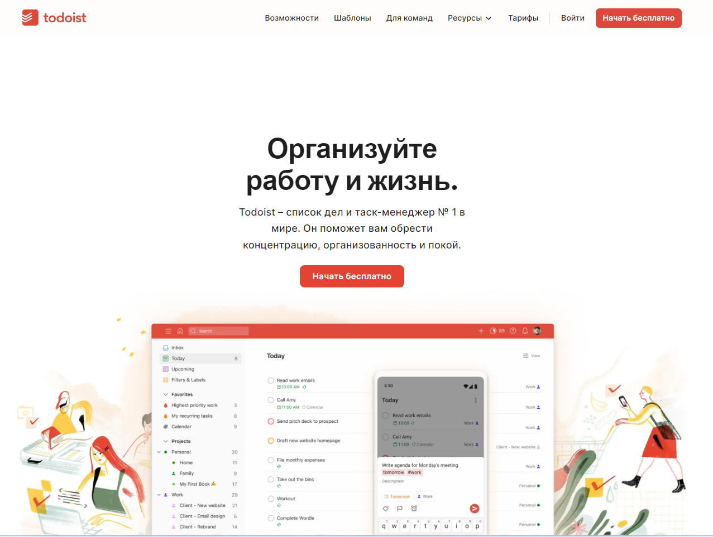
</p>

# <a name="Содержание">Содержание</a>

+ [Описание](#Описание)
+ [Технологии и инструменты](#Технологии-и-инструменты)
+ [Варианты запуска](#Варианты-запуска)
    + [Команды для gradle](#команды-для-gradle)
    + [Запуск в Jenkins](#запуск-в-jenkins)
+ [Telegram уведомления](#Telegram-уведомления)
+ [Результаты тестов в Allure Report](#Результаты-тестов-в-Allure-Report)
+ [Интеграция с Allure TestOps](#Интеграция-с-Allure-TestOps)
+ [Интеграция с Jira](#Интеграция-с-Jira)
+ [Видео запуска тестов](#Видео-запуска-тестов)

# <a name="Описание">Описание</a>
Тестовый проект состоит из веб-тестов (UI), тестов API и мобильных тестов (Android).\
Краткий список интересных фактов о проекте:
- [x] `Page Object` проектирование
- [x] Параметризованные тесты
- [x] Различные файлы конфигурации для запуска теста в зависимости от параметров сборки
- [x] Конфигурация с библиотекой `Owner`
- [x] Использование `Lombok` для моделей в API тестах
- [x] Использование request/response спецификаций для API тестов
- [x] Custom Allure listener для API requests/responses логов
- [x] Интеграция с `Allure TestOps`
- [x] Автотесты как тестовая документация
- [x] Интеграция с `Jira`
- [x] Уведомление в `Telegram`

# <a name="Технологии и инструменты">Технологии и инструменты</a>
<p  align="center">
  <code></code>
  <code></code>
  <code></code>
  <code></code>
  <code></code>
  <code></code>
  <code></code>
  <code></code>
  <code></code>
  <code></code>
  <code></code>
  <code></code>
  <code></code>
  <code></code>
  <code></code>
  <code></code>
</p>

Автотесты в этом проекте написаны на `Java` использую `Selenide` фреймворк.\
`Gradle` - используется как инструмент автоматизации сборки.  \
`JUnit5` - для выполнения тестов.\
`REST Assured` - для тестирования REST-API сервисов.\
`Jenkins` - CI/CD для запуска тестов удаленно.\
`Selenoid` - для удаленного запуска браузера в `Docker` контейнерах.\
`Browserstack` - для запуска мобильных тестов удаленно.\
`Android Studio tools`, `Appium` - для запуска мобильных тестов локально на эмуляторе мобильных устройств.\
`Allure Report` - для визуализации результатов тестирования.\
`Telegram Bot` - для уведомлений о результатах тестирования.\
`Allure TestOps` - как система управления тестированием.

[Вернуться к оглавлению ⬆](#Содержание)

# <a name="Варианты запуска">Варианты запуска</a>

## <a name="GradleCommand">Команды для Gradle</a>
Для запуска локально и в Jenkins используется следующая команда::
```bash
gradle clean test -Dtag=<tag> 
```
Дополнительные параметры:
> `-Denv=local` `-Denv=remote` - запуск локально или удаленно для selenoid\
> `-DdeviceHost=android` `-DdeviceHost=emulator` - запуск мобильных тестов в browserstack или на эмуляторе\


`tag` - теги для запуска выполнения тестов:
>- *api*
>- *ui*
>- *mobile*


Дополнительные свойства извлекаются из соответствующего файла конфигурации :
```bash
./resources/config/${runIn}.properties
```

Допустимые комбинации:
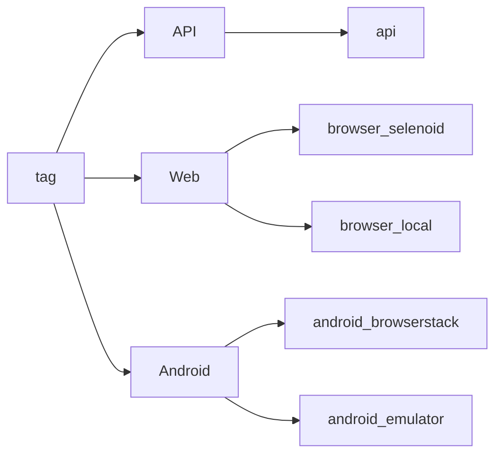

## <a name="Запуск в Jenkins">Запуск в [Jenkins](https://jenkins.autotests.cloud/job/021-bulatov-UI/)</a>
Главная страница сборки:
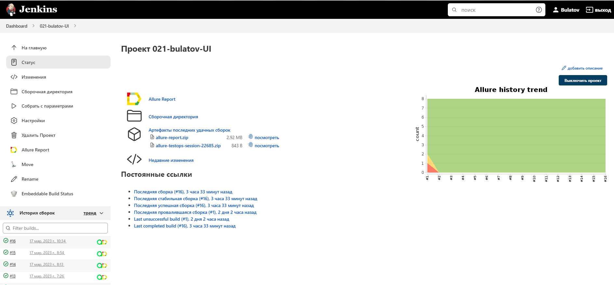

2. Выбрать пункт **Собрать с параметрами**
3. В случае необходимости изменить параметры, выбрав значения из выпадающих списков
4. Нажать **Собрать**
5. Результат запуска сборки можно посмотреть в отчёте Allure

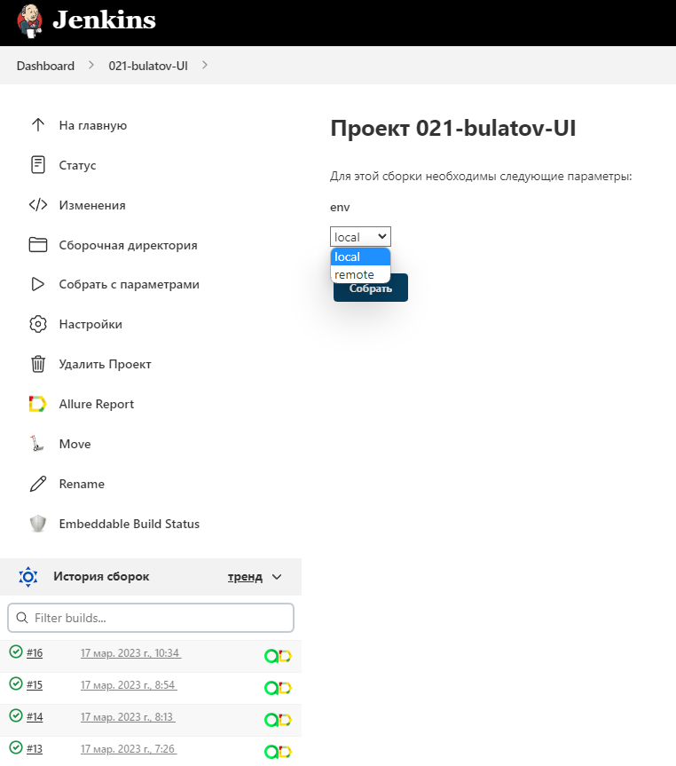

Конфиденциальная информация (имена для входа и пароли) хранится в зашифрованном виде в хранилище учетных данных Jenkins.\
И относительно безопасно передается в сборку аргументами gradle, а его значения маскируются в логах.

После завершения сборки результаты тестирования доступны в:
>- <code><strong>*Allure Report*</strong></code>
>- <code><strong>*Allure TestOps*</strong></code> - результаты загружаются туда и тест-кейсы могут автоматически обновляться в соответствии с последними изменениями в коде.

[Вернуться к оглавлению ⬆](#Содержание)

# <a name="AllureReport">Результаты тестов в [Allure Report](href="https://jenkins.autotests.cloud/job/021-bulatov-UI/16/allure/)</a>


###  Главное окно

<p align="center">
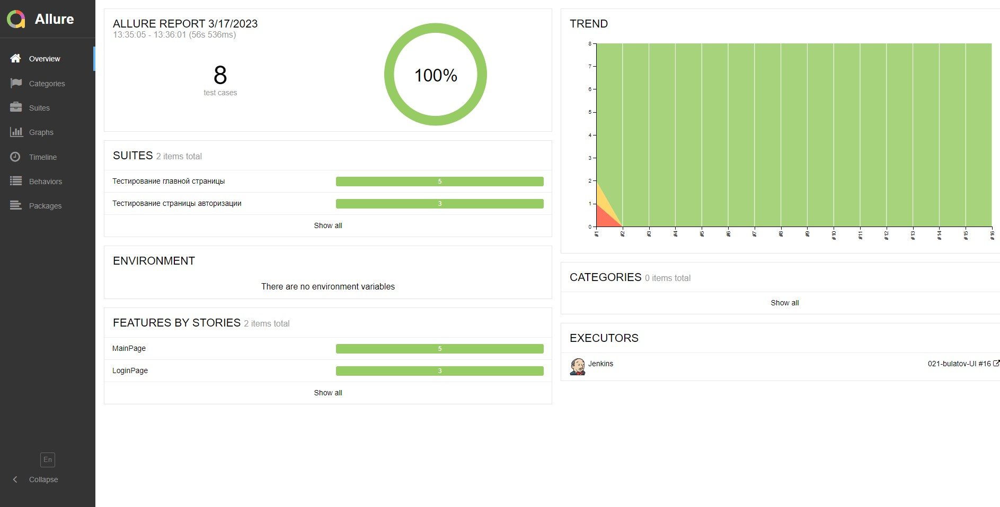
</p>

###  Тесты

<p align="center">
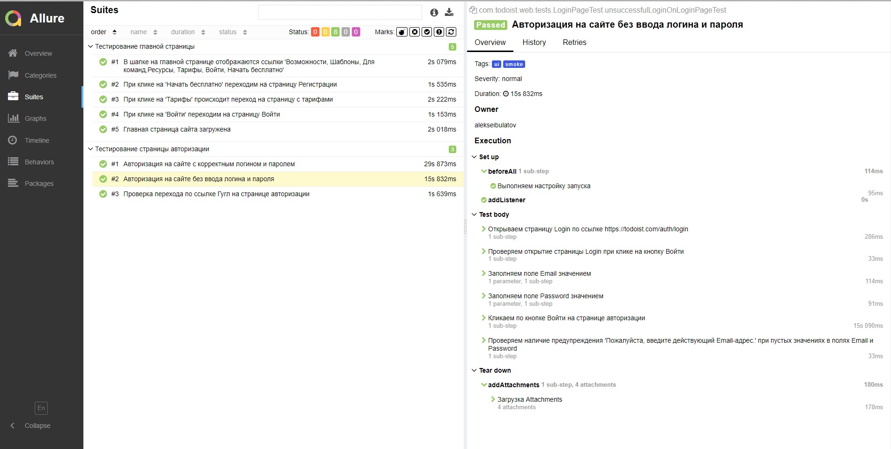
</p>

###  Графики

<p align="center">
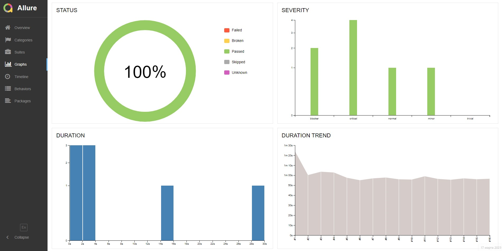
</p>

[Вернуться к оглавлению ⬆](#Содержание)

# <a>Интеграция с [Allure TestOps](https://allure.autotests.cloud/launch/20672)</a>
> Ссылка доступна только авторизованным пользователям.

Тест-кейсы в проекте импортируются и постоянно обновляются из кода,
поэтому нет необходимости в синхронизации ручных тест-кейсов и автотестов.\
Достаточно создать и обновить автотест в коде и тест-кейс всегда будет в актуальном состоянии.

## Allure TestOps Dashboard


### Общий список всех кейсов: ручных и авто
<p align="center">
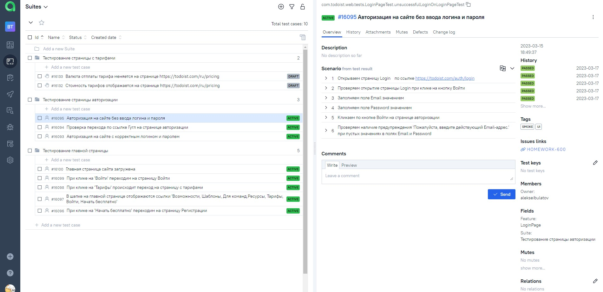
</p>

### Dashboard с общими результатами тестирования
<p align="center">
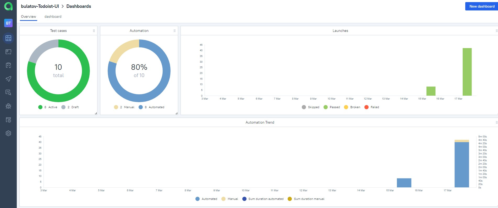
</p>

### Пример отчёта выполнения одного из автотестов
<p align="center">
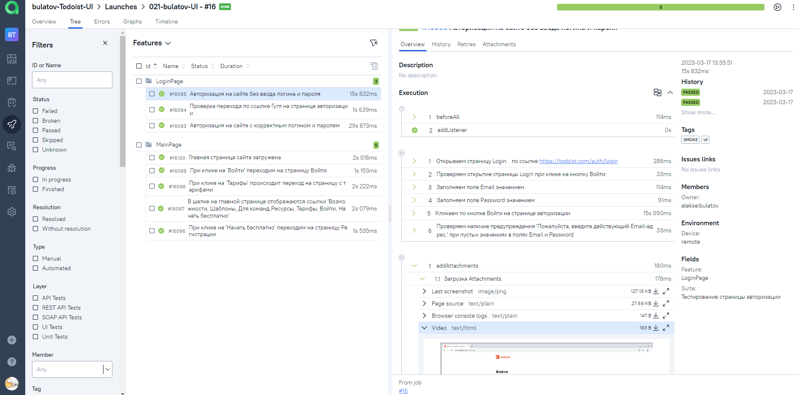
</p>

[Вернуться к оглавлению ⬆](#Содержание)
# <a>Интеграция с Jira</a>


<p align="center">
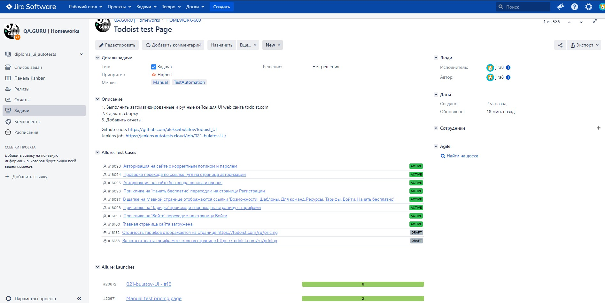
</p>

[Вернуться к оглавлению ⬆](#Содержание)

# <a>Telegram уведомления</a>
Telegram-бот отправляет краткий отчет в указанный телеграм-чат по результатам каждой сборки.


<p align="center">
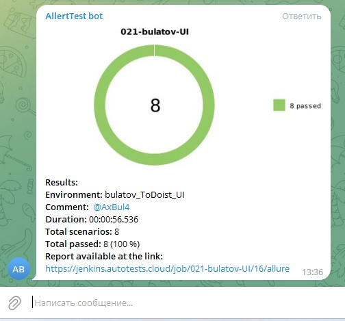
</p>

# <a>Видео запуска тестов</a>

<p align="center">
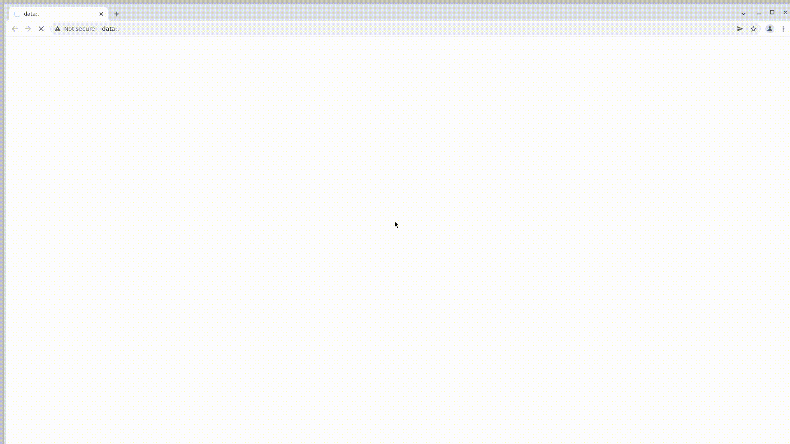</a>
</p>

[Вернуться к оглавлению ⬆](#Ссылка)